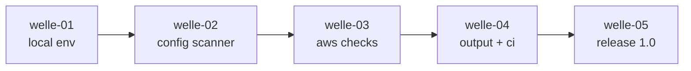

# Roadmap

**Status:** Aktiv. **Letzte Änderung:** 2026-06-24.

**Format-Regel:** Die Roadmap ist eine Reihenfolge von **Wellen**, keine
Reihenfolge von Terminen. Die Wellen bilden die Versions-Stufen
`LH-RM-*` des Lastenhefts ab.

---

## Aktuelle Welle

**Welle-ID:** welle-01-lokaler-env-check
**Start:** 2026-06-24
**Geplantes Ende:** offen (Schätzung folgt nach [ADR-0002](../../adr/0002-implementierungssprache.md)-Sign-off)

**Closure-Trigger:** siehe [`../welle-01-lokaler-env-check.md`](../welle-01-lokaler-env-check.md).

> **Blockiert durch [`ADR-0002`](../../adr/0002-implementierungssprache.md)** (Implementierungssprache, *Proposed*): Der
> erste Code-Slice braucht die bestätigte Sprachwahl, bevor die Toolchain
> (`make lint/test/build`) verdrahtet wird.

## Nächste Wellen

| Welle | Version (LH-RM) | Trigger | Wichtigste Slices | Aufwand |
|---|---|---|---|---|
| welle-02-config-scanner | v0.2 (`RM-002`) | Welle 1 done | Claude-Code-, Devcontainer-, Docker-, Terraform-Scanner (`CLAUDE/DEVCON/DOCKER/TF-*`) | L |
| welle-03-aws-checks | v0.3 (`RM-003`) | Welle 2 done | AWS-STS-, Bedrock-, IAM-Prüfung (`AWS/BEDROCK/IAM-*`, `AUTH-001`); `awscli`-Adapter + Mock | L |
| welle-04-output-ci | v0.4 (`RM-004`) | Welle 3 done | JSON-/SARIF-Ausgabe, CI-Modus (`REP-002/003`, `MOD-005`) | M |
| welle-05-release | v1.0 (`RM-005`) | Welle 4 done | Doku, Docker-Image, Devcontainer-Feature, Release-Artefakte (`QA-004`, `TECH-004/005`) | M |

## Meilensteine

| Meilenstein | Welle(n) | Trigger | Status |
|---|---|---|---|
| M0 — Harness bereit | — | Greenfield-Bootstrap abgeschlossen | erreicht (2026-06-24) |
| M1 — erstes lauffähiges Tool | welle-01 | `bedrock-eu-check local` liefert PASS/WARN/FAIL + Exit-Codes | offen |
| M2 — vollständiger statischer Scan | welle-02 | Config/Container/Terraform abgedeckt | offen |
| M3 — AWS-Live-Checks | welle-03 | STS/Bedrock/IAM read-only | offen |
| M4 — CI-fähig | welle-04 | SARIF + `--ci` + Exit-Code 1 bei FAIL | offen |
| M5 — Release 1.0 | welle-05 | Docker-Image + Doku + Tests grün | offen |

## Abhängigkeitsgraph

## Abgeschlossene Wellen

(noch keine)

## Historische Trigger-Verschiebungen

(noch keine)
