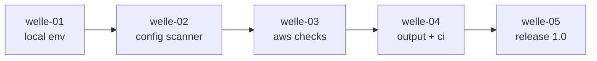

# Roadmap

**Status:** Aktiv. **Letzte Änderung:** 2026-11-11.

**Format-Regel:** Die Roadmap ist eine Reihenfolge von **Wellen**, keine
Reihenfolge von Terminen. Die Wellen bilden die Versions-Stufen
`LH-RM-*` des Lastenhefts ab.

---

## Aktuelle Welle

(keine; alle geplanten Wellen sind abgeschlossen)

welle-01 bis welle-05 sind abgeschlossen. Release 1.0.0 ist am 2026-11-11 veröffentlicht
(Tag `v1.0.0` auf Commit `5f1b35cca776`, GitHub-Release, Images auf `ghcr.io`, Devcontainer-Feature),
siehe [`../done/welle-01-results.md`](../done/welle-01-results.md),
[`../done/welle-02-results.md`](../done/welle-02-results.md),
[`../done/welle-03-results.md`](../done/welle-03-results.md),
[`../done/welle-04-results.md`](../done/welle-04-results.md) und
[`../done/welle-05-results.md`](../done/welle-05-results.md). Die Pläne liegen unter
[`../done/`](../done/), zuletzt [`../done/welle-05-release.md`](../done/welle-05-release.md).

## Nächste Wellen

(keine weiteren Wellen geplant; Folgeaufgaben der Qualitätsrunde siehe [`../done/welle-05-results.md`](../done/welle-05-results.md))

## Meilensteine

| Meilenstein | Welle(n) | Trigger | Status |
|---|---|---|---|
| M0 — Harness bereit | — | Greenfield-Bootstrap abgeschlossen | erreicht (2026-06-24) |
| M1 — erstes lauffähiges Tool | welle-01 | `bedrock-eu-check local` liefert PASS/WARN/FAIL + Exit-Codes | erreicht (2026-11-10) |
| M2 — vollständiger statischer Scan | welle-02 | Config/Container/Terraform abgedeckt | erreicht (2026-11-10) |
| M3 — AWS-Live-Checks | welle-03 | STS/Bedrock/IAM read-only | erreicht (2026-11-10) |
| M4 — CI-fähig | welle-04 | SARIF + `--ci` + Exit-Code 1 bei FAIL | erreicht (2026-11-10) |
| M5 — Release 1.0 | welle-05 | Docker-Image + Doku + Tests grün | erreicht (2026-11-11, veröffentlicht) |

## Abhängigkeitsgraph

```mermaid
flowchart LR
    W1[welle-01<br/>local env] --> W2[welle-02<br/>config scanner]
    W2 --> W3[welle-03<br/>aws checks]
    W3 --> W4[welle-04<br/>output + ci]
    W4 --> W5[welle-05<br/>release 1.0]
```

## Abgeschlossene Wellen

- welle-01-lokaler-env-check, abgeschlossen 2026-11-10, siehe [`done/welle-01-results.md`](../done/welle-01-results.md).
- welle-02-config-scanner, abgeschlossen 2026-11-10, siehe [`done/welle-02-results.md`](../done/welle-02-results.md).
- welle-03-aws-checks, abgeschlossen 2026-11-10, siehe [`done/welle-03-results.md`](../done/welle-03-results.md).
- welle-04-output-ci, abgeschlossen 2026-11-10, siehe [`done/welle-04-results.md`](../done/welle-04-results.md).

## Historische Trigger-Verschiebungen

(noch keine)
