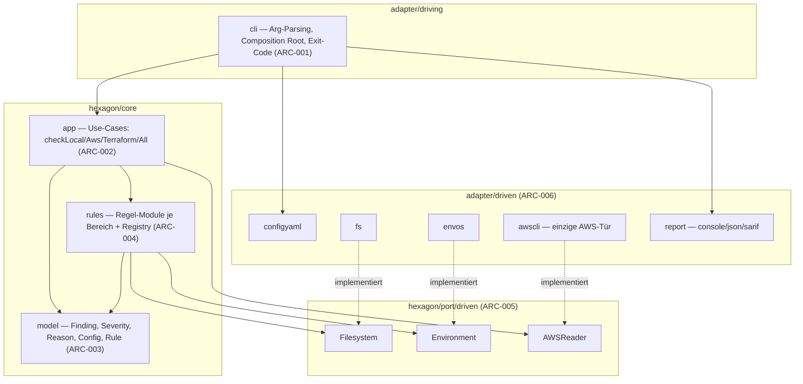
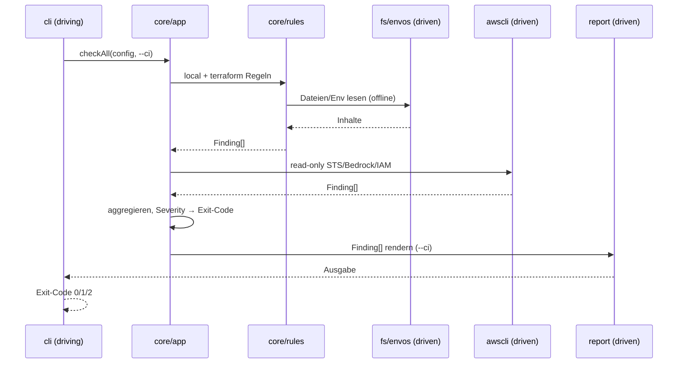

# Architektur — Bedrock EU Configuration Checker (`bedrock-eu-check`)

**Status:** Aktiv (Phase 2 — Outline). **Letzte Änderung:** 2026-06-24.

**Hard Rule:** Diese Datei enthält *keine* Wellen, Slices, Commit-Hashes
oder Closure-Daten. Die zeitliche Schicht lebt in
[`../docs/plan/planning/in-progress/roadmap.md`](../docs/plan/planning/in-progress/roadmap.md).
ID-Schema `ARC-*` siehe
[`../harness/conventions.md`](../harness/conventions.md) [`MR-002`](../harness/conventions.md#mr-002--id-schema-kanon-präfix-lh--mit-bereichscodes).

**Architekturstil:** Hexagonal (Ports & Adapters), Ordnerkonvention nach
dem Vorbild **d-check**. Die Schichtung und ihre Constraints sind über die
zugehörige ADR verbindlich, die das aufwärts deklariert.

---

## 1. Komponenten-Übersicht

Innen liegt der seiteneffektfreie Kern (`hexagon/core`); nach außen folgen
Ports (Interfaces) und Adapter. Adapter sind getrennt in **driving**
(treibt den Kern: CLI) und **driven** (wird vom Kern getrieben: Datei,
Env, AWS, Config, Report).

## 2. Schichten und Constraints

| Schicht (ARC-ID) | Verantwortlichkeit | Darf importieren | Darf NICHT importieren |
|---|---|---|---|
| `ARC-003` `core/model` | Finding, Severity (`PASS/WARN/FAIL`), Reason-Codes, Config, Rule — **importfreier Ring** | Stdlib | alles Interne |
| `ARC-004` `core/rules` | Regel-Module je Bereich (LENV, CLAUDE, …), Registry, Orchestrator (`run`) | `model`, `port/driven` | Adapter, `app` |
| `ARC-002` `core/app` | Use-Cases pro Modus, Findings sammeln, Severity → Exit-Code | `model`, `rules`, `port/driven` | Adapter |
| `ARC-005` `port/driven` | Interfaces, die der Kern braucht: `Filesystem`, `Environment`, `AWSReader` | `model` | Adapter |
| `ARC-006` `adapter/driven/*` | Port-Implementierungen: `configyaml`, `fs`, `envos`, `awscli`, `report` | `model`, `port/driven` | `rules`, `app`-Interna |
| `ARC-001` `adapter/driving/cli` | Arg-Parsing, **Composition Root** (verdrahtet Adapter→Kern), Exit-Code-Mapping | alles | — |

**Tragende Constraints (durchsetzbar als Fitness Function, `make
arch-check`, sobald Code existiert):**

- **`ARC-007` — Einzige AWS-Tür.** Nur `adapter/driven/awscli` darf
  ein AWS-SDK/CLI berühren; jeder andere AWS-Zugriff ist ein
  Architekturverstoß. Damit bleibt der `local`/`terraform`-Pfad strukturell
  offline ([`LH-NF-005`](lastenheft.md#lh-nf-005--offline-fähigkeit)) und read-only ([`LH-SEC-003`](lastenheft.md#lh-sec-003--read-only-aws-zugriff)).
- **Reiner Kern.** `core/model` importiert nichts Internes; `core/rules`
  /`core/app` kennen nur `model` + `port` — nie einen Adapter.
- **Kein Secret zum Reporter.** Der `report`-Adapter erhält nur
  `Finding`-Objekte; Secret-Maskierung („set"/„not set") passiert im Kern
  ([`LH-NF-004`](lastenheft.md#lh-nf-004--keine-secret-ausgabe)).

## 3. Externe Abhängigkeiten

| System | Rolle | Hinter Port / Substituierbarkeit |
|---|---|---|
| AWS CLI/SDK (read-only) | Identität, Bedrock-Profile, IAM | `AWSReader` (`port/driven`); `coretest/fakeaws` als Double ([`LH-QA-002`](lastenheft.md#lh-qa-002--integration-tests)) |
| Dateisystem | `.env`, `.tf`, `.claude/settings*.json`, devcontainer, compose, Dockerfile | `Filesystem`-Port; `coretest/memfs` als Double |
| Umgebung | Env-Variablen (`AWS_REGION`, `ANTHROPIC_API_KEY`, …) | `Environment`-Port; `fakeenv` als Double |
| YAML/HCL/JSON-Parser | Config + Eingabe-Dateien parsen | im jeweiligen `driven`-Adapter gekapselt |

## 4. Sequenz-Diagramme

### Use-Case: `bedrock-eu-check all --ci` (LH-MOD-004/005)

## 5. Fehlermodelle und Resilienz

| Fehlerquelle | Behandlung-Schicht | Verhalten |
|---|---|---|
| Config unlesbar/ungültig | `configyaml` → `cli` | Abbruch, Exit `2` ([`SPEC-030`](spezifikation.md#spec-030--exit-codes)) |
| AWS nicht erreichbar / keine Credentials | `awscli` → `app` | `FAIL` für AWS-Regeln; offline-Regeln laufen weiter |
| dynamischer Terraform-Ausdruck | `rules` (TF) | `WARN` statt falschem `FAIL` ([`LH-RISK-003`](lastenheft.md#lh-risk-003--false-positives-bei-terraform)) |
| unbekannte Modell-/Profil-ID | `rules` (Klassifikation) | `WARN` ([`SPEC-010`](spezifikation.md#spec-010--klassifikation-von-modell-profil-ids)) |
